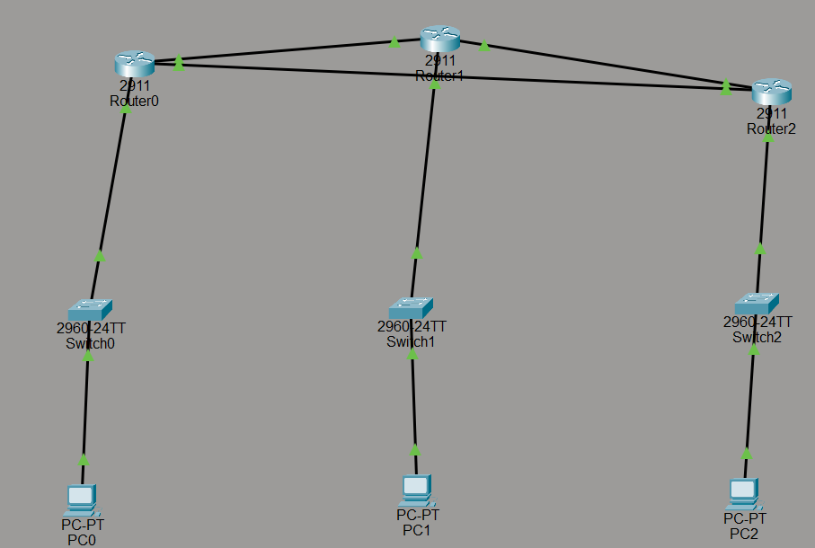
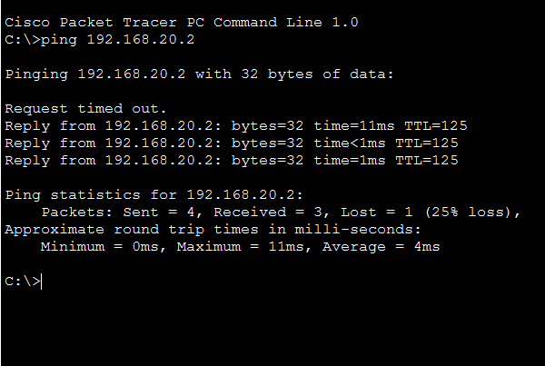

# Multi-Router OSPF Network Project (Cisco Packet Tracer)

## 📌 Project Overview
This project demonstrates the implementation and configuration of a **Dynamic Routing Protocol (OSPF - Open Shortest Path First)** across multiple interconnected routers using Cisco Packet Tracer. The network is designed to ensure redundancy, efficient path selection, and seamless communication between different branch networks.

---

## 🛠️ Network Topology & Architecture
The network consists of:
* **3 Routers** configured with OSPF routing.
* **3 Switches** connecting the local area networks (LANs).
* **3 End Devices (PCs)** acting as clients in separate subnets.

### 🌐 IP Addressing Scheme:
* **Router0 LAN (`PC0`):** `192.168.10.0/24` (Gateway: `192.168.10.1`, PC IP: `192.168.10.2`)
* **Router1 LAN:** `192.168.20.0/24` (Gateway: `192.168.20.1`, PC IP: `192.168.20.2`)
* **Router2 LAN:** `192.168.30.0/24` (Gateway: `192.168.30.1`, PC IP: `192.168.30.2`)
* **WAN Links (Subnets):** Serial/Gigabit connections using `/30` subnets (`10.1.1.0/30`, `10.1.2.0/30`, `10.1.3.0/30`).

---

## 🚀 Key Features & Configuration Steps
1. **Interfaces Configuration:** Assigned correct IP addresses and subnet masks to all router interfaces and enabled them (`no shutdown`).
2. **OSPF Configuration:** Configured OSPF routing protocol across all routers using a single area (`Area 0`) to dynamically advertise connected and local networks.
3. **Verification & Testing:**
   * Verified OSPF neighbor adjacencies using `show ip ospf neighbor`.
   * Checked the routing table using `show ip route` to confirm the presence of OSPF (`O`) routes.
   * Tested end-to-end connectivity using `ping` between the PCs.

---

## 📸 Project Screenshots & Proof of Work

### 1. Network Topology Diagram

### 2. OSPF Routing Table (`Router0`)

### 3. Successful Ping Test Connectivity

---

## 📂 Repository Contents
* `OSPF_Redundant_Project.pkt` — The Cisco Packet Tracer simulation file.
* `network-topology.png` — Overview of the network layout.
* `routing-table-router0.png` — Routing table verification output.
* `ping-test-result.png` — End-to-end communication test result.

---
*Created as part of networking and IT infrastructure training.*
